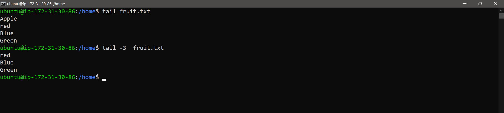

Basic Linux Commands - Day 3

Task 1: View the content of a file and display line numbers.

Task 2: Change the access permissions of files to make them readable, writable, and executable by the owner only.

Task 3: Check the last 10 commands you have run.

Task 4: Remove a directory and all its contents.

Task 5: Create a fruits.txt file, add content (one fruit per line), and display the content.

Task 6: Add content in devops.txt (one in each line) - Apple, Mango, Banana, Cherry, Kiwi, Orange, Guava. Then, append "Pineapple" to the end of the file.

Task 7: Show the first three fruits from the file in reverse order.

Task 8: Show the bottom three fruits from the file, and then sort them alphabetically.

Task 9: Create another file Colors.txt, add content (one color per line), and display the content.

Task 10: Add content in Colors.txt (one in each line) - Red, Pink, White, Black, Blue, Orange, Purple, Grey. Then, prepend "Yellow" to the beginning of the file.

Task 11: Find and display the lines that are common between fruits.txt and Colors.txt.

Task 12: Count the number of lines, words, and characters in both fruits.txt and Colors.txt.

