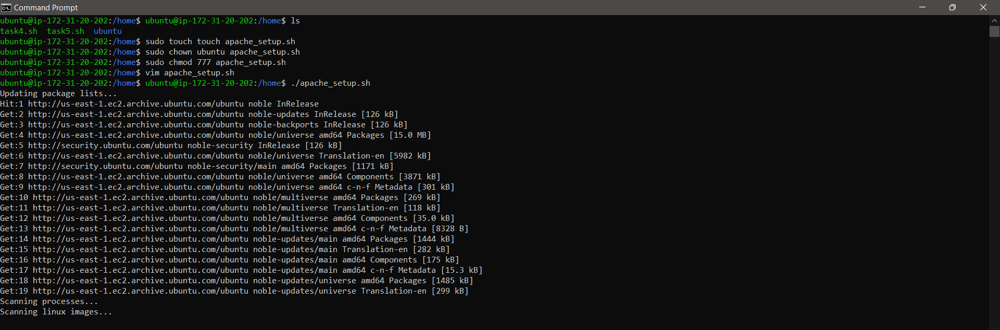
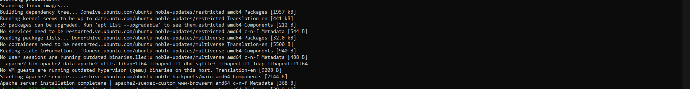
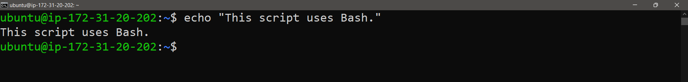
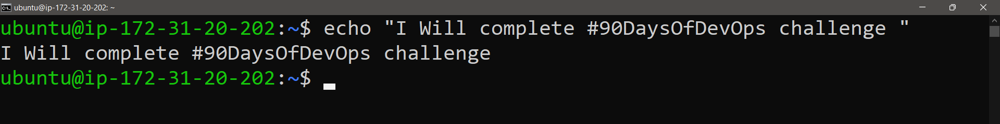
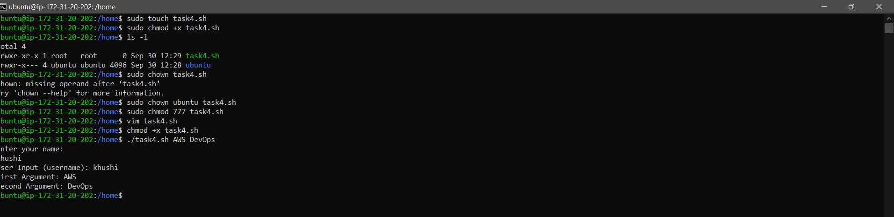
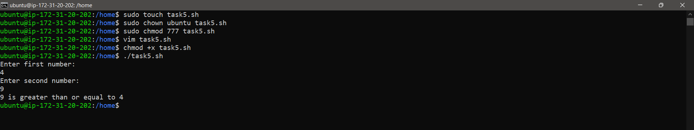

Day 4 Answers:
Basic Linux Shell Scripting for DevOps Engineers

Task 1: Explain in your own words and with examples what Shell Scripting means for DevOps.

 * Shell Scripting is writing a series of commands in a script file to automate tasks in the Unix/Linux shell. For DevOps, shell scripting is crucial for automating repetitive tasks, managing system configurations, deploying applications, and integrating various tools and processes in a CI/CD pipeline. It enhances efficiency, reduces errors, and saves time.'

Example: Automating server setup

Task 2: What is #!/bin/bash? Can we write #!/bin/sh as well?

 * #!/bin/bash is called a "shebang" line. It indicates that the script should be run using the Bash shell.
 ⚪ #!/bin/bash: Uses Bash as the interpreter. It supports advanced features like arrays, associative arrays, and functions.
 ⚪ #!/bin/sh: Uses the Bourne shell. It’s more POSIX-compliant and is generally compatible with different Unix shells.

Task 3: Write a Shell Script that prints I will complete #90DaysOfDevOps challenge.

Task 4: Write a Shell Script that takes user input, input from arguments, and prints the variables.

Task 5: Provide an example of an If-Else statement in Shell Scripting by comparing two numbers.
