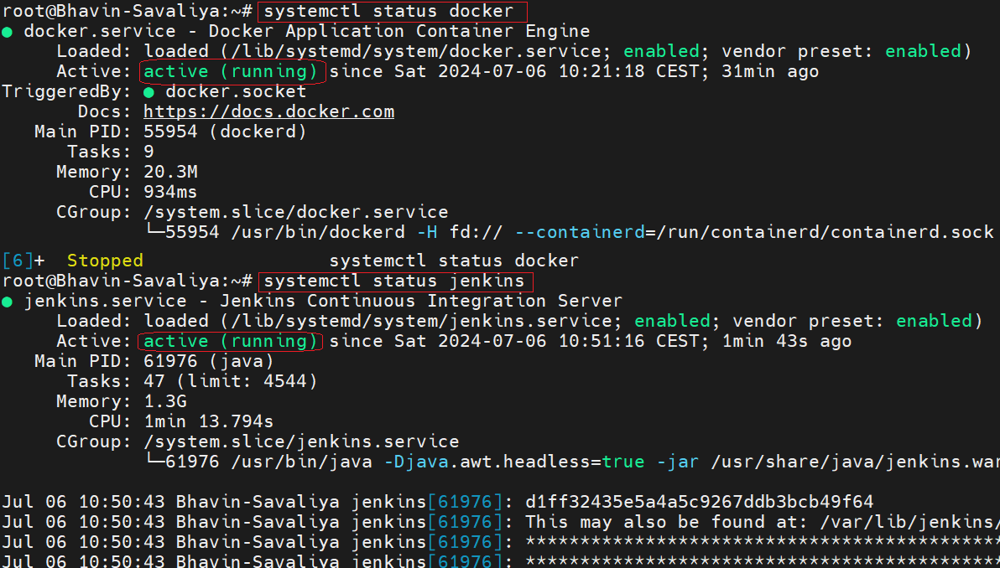
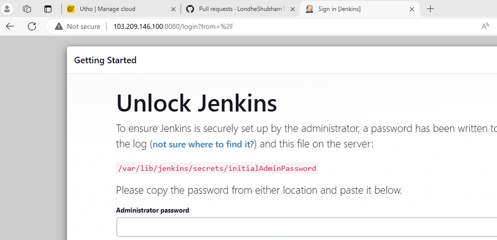
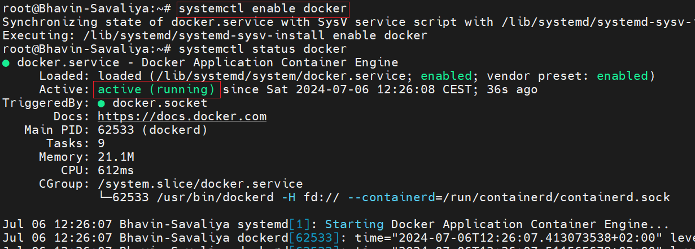
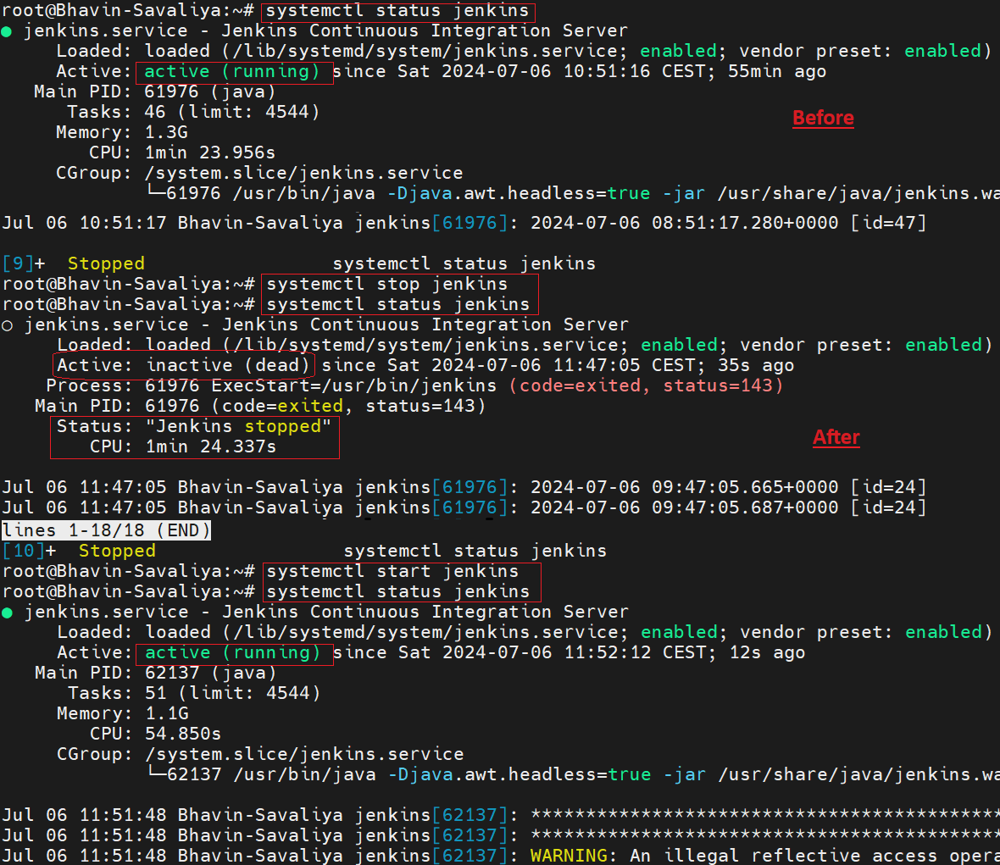
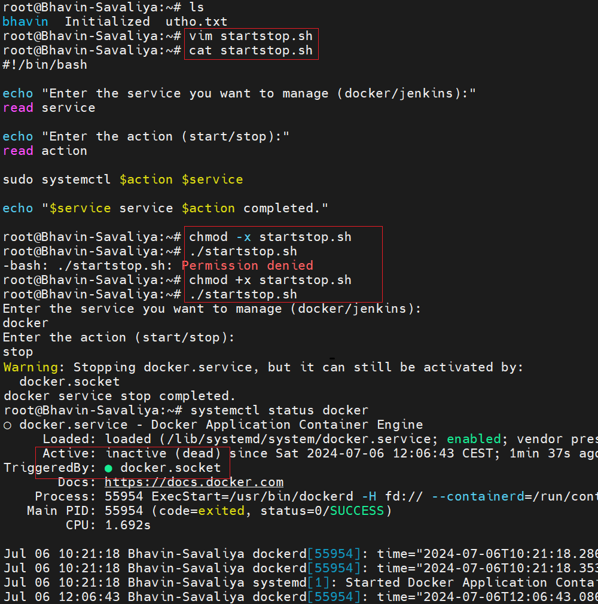
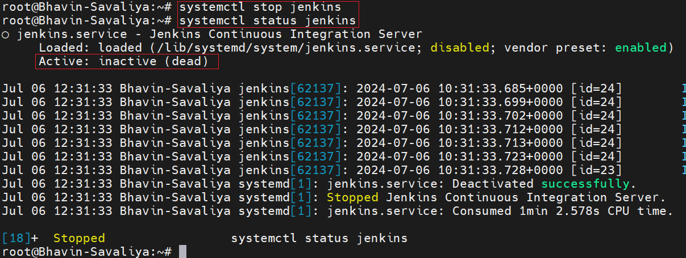
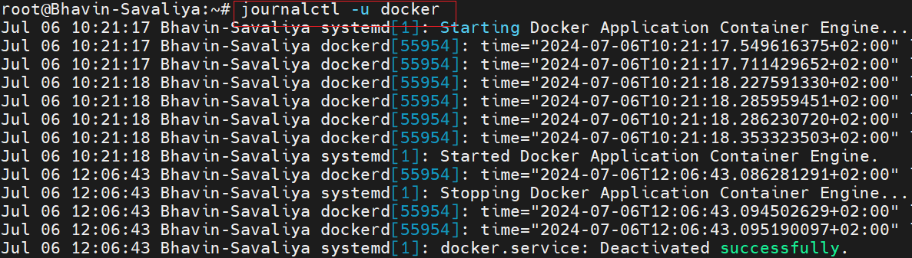
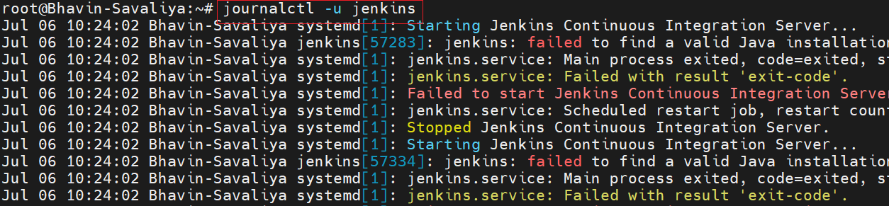

## Day 7 Answers: Understanding Package Manager and Systemctl

# Tasks

1. Install Docker and Jenkins:

⚪ Install Docker and Jenkins on your system from your terminal using package managers.

Answer 
⚪ First-Installing Docker 
    ■ Update the package list and install required packages: 
   <pre>
   sudo apt update 
   sudo apt install apt-transport-https ca-certificates curl software-properties-common 
   </pre>
  
   ■ Add Docker’s official GPG key: 
   <pre>
   curl -fsSL https://download.docker.com/linux/ubuntu/gpg | sudo apt-key add -      
   </pre>    

   ■ Add the Docker APT repository:  
   <pre>
   sudo add-apt-repository "deb [arch=amd64] https://download.docker.com/linux/ubuntu $(lsb_release -cs) stable" '
   </pre> 

   ■ Update the package list again: 
  <pre>
   sudo apt update
  </pre>

   ■ Install Docker: 
  <pre>
   sudo apt install docker-ce 
  </pre>

   ■ Check Docker installation: 
  <pre>
   sudo systemctl status docker
  </pre>

⚪ Installing Jenkins 
   ■ Add the Jenkins repository key to the system: 
  <pre>
   curl -fsSL https://pkg.jenkins.io/debian/jenkins.io.key | sudo apt-key add -
  </pre>
 
   ■ Add the Jenkins repository: 
  <pre>
   sudo sh -c 'echo deb http://pkg.jenkins.io/debian-stable binary/ > /etc/apt/sources.list.d/jenkins.list'</pre>

   ■ Update the package list: 
  <pre>
   sudo apt update
  </pre>

   ■ Install Jenkins: 
<pre>
   sudo apt install jenkins
</pre>

  ■ Start Jenkins: 
<pre>
   sudo systemctl start jenkins
</pre>

## Note: 

 ■ First, check whether JAVA is installed or not. 
  <pre>
   java -version
  </pre>

 ■ If you have not installed 
 <pre>
   sudo apt install default-jre
 </pre>

## Output  

Output (Jenkins-UI) 

2. Write a Blog or Article:  

 ⚪ Write a small blog or article on how to install these tools using package managers on Ubuntu and CentOS.

Answer 

i. Introduction: 
  ■ Briefly introduce Docker and Jenkins. 
  ■ Mention the operating systems (Ubuntu and CentOS) covered.

ii. Installing Docker on Ubuntu: 
  ■ List the steps as detailed above. 

iii. Installing Docker on CentOS: 
  ■ Provide similar steps adjusted for CentOS. 

iv. Installing Jenkins on Ubuntu: 
  ■ List the steps as detailed above. 

v. Installing Jenkins on CentOS: 
  ■ Provide similar steps adjusted for CentOS. 

## Systemctl and Systemd
Systemctl is used to examine and control the state of the “systemd” system and service manager. Systemd is a system and service manager for Unix-like operating systems (most distributions, but not all). 

## Tasks 
1. Check Docker Service Status: 
Check the status of the Docker service on your system (ensure you have completed the installation tasks above).
 
Answer  

2. Manage Jenkins Service: 

 ⚪ Stop the Jenkins service and post before and after screenshots. 

Answer 

3. Read About Systemctl vs. Service: 

  ⚪Read about the differences between the systemctl and service commands.
  ⚪ Example: systemctl status docker vs. service docker status. 

## Answer 

 ⚪ Understanding the systemctl and service Commands  
     ■ Both systemctl and service commands are used to manage system services in Linux, but they differ in terms of usage, functionality, and the system architectures they support. 
      ■ systemctl Command  
          ■ systemctl is a command used to introspect and control the state of the systemd system and service manager. It is more modern and is used in systems that use systemd as their init system, which is common in many contemporary Linux distributions.
## Examples: 
  ■ Check the status of the Docker service: 
<pre>
   sudo systemctl status docker 
</pre>   
  ■ Start the Jenkins service: 
<pre>
   sudo systemctl start jenkins 
</pre>
  ■ Stop the Docker service:
<pre>
   sudo systemctl stop docker
</pre>
  ■ Enable the Jenkins service to start at boot:
<pre>
   sudo systemctl enable jenkins
</pre>
 
■ service Command 
  ■ 'service' is a command that works with the older 'init' systems (like SysVinit). It provides a way to start, stop, and check the status of services. While it is still available on systems using 'systemd' for backward compatibility, its usage is generally discouraged in favor of 'systemctl'. 

■ Examples: 

1) Check the status of the Docker service: 
<pre>
   sudo service docker status 
</pre>   
2) Start the Jenkins service: 
<pre>
   sudo service jenkins start
</pre>
3) Stop the Docker service: 
<pre>
   sudo service docker stop
</pre>

## Key Differences  

1 System Architecture: 
  ■ systemctl works with systemd.  
  ■ service works with SysVinit and is compatible with systemd for backward compatibility.

2 Functionality: 
  ■ systemctl offers more functionality and control over services, including management of the service's state (start, stop, restart, reload), enabling/disabling services at boot, and querying detailed service status. 
  ■ service provides basic functionality for managing services, such as starting, stopping, and checking the status of services.

3 Syntax and Usage: 
  ■ systemctl uses a more unified syntax for managing services. 
  ■ service has a simpler and more traditional syntax.

## Additional Tasks
 
4. Automate Service Management: 

 ⚪ Write a script to automate the starting and stopping of Docker and Jenkins services. 

Answer  

5. Enable and Disable Services: 

 ⚪ Use systemctl to enable Docker to start on boot and disable Jenkins from starting on boot. 

Answer 
⚪ Enable Docker to start on boot: 

⚪ Disable Jenkins from starting on boot: 

Analyze Logs: 
⚪ Use journalctl to analyze the logs of the Docker and Jenkins services. Post your findings. 

Answer
⚪ Docker Logs: 

⚪ Jenkins Logs: 
