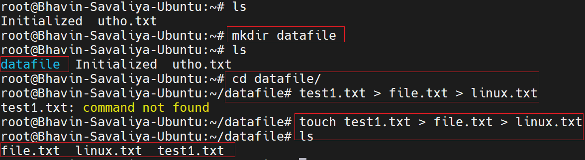
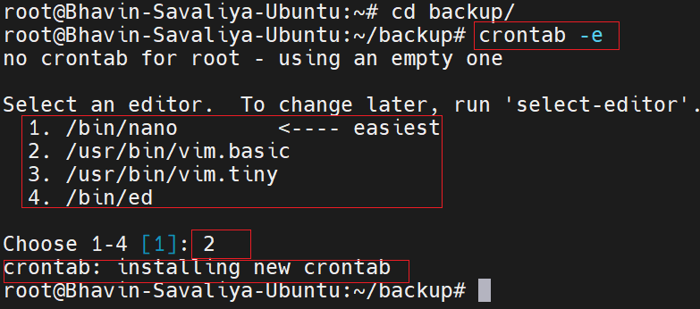
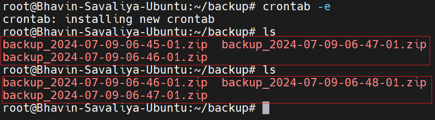
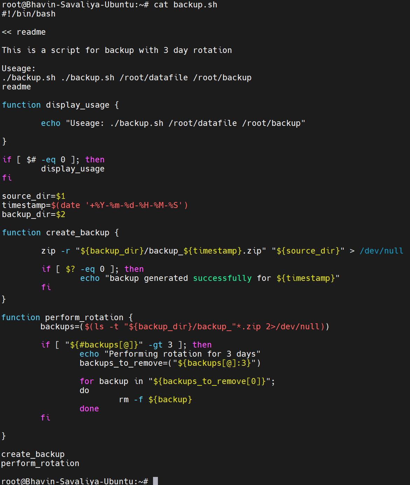

# Day 9 Answers: Shell Scripting Challenge Directory Backup with Rotation

## Tasks

1.Challenge Description

Your task is to create a bash script that takes a directory path as a command-line argument and performs a backup of the directory. The script should create timestamped backup folders and copy all the files from the specified directory into the backup folder.

Additionally, the script should implement a rotation mechanism to keep only the last 3 backups. This means that if there are more than 3 backup folders, the oldest backup folders should be removed to ensure only the most recent backups are retained.

The script will create a timestamped backup folder inside the specified directory and copy all the files into it. It will also check for existing backup folders and remove the oldest backups to keep only the last 3 backups.

Answer

Create a Folder And Make Some File

Note:
First, check whether zip is installed or not.
<pre>
   zip  
</pre>

If you have not installed
<pre>
   sudo apt install zip
</pre>

Crontab Job Scheduling:

Auto scheduling through crontab job scheduling:
<pre>
   * 1 * * * bash /root/backup.sh /root/datafile /root/backup 
</pre>

It will take a backup every hour, and the oldest backups will be deleted, leaving only the latest three backups visible:

Bash Script:

