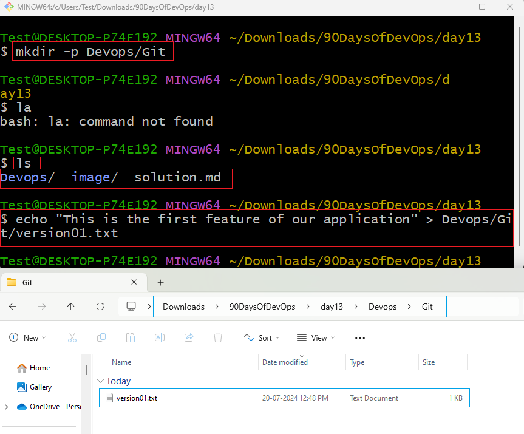
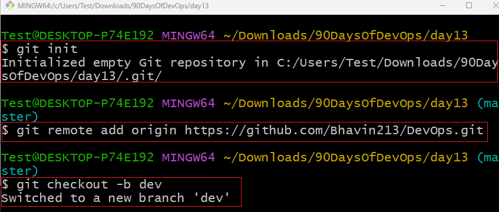
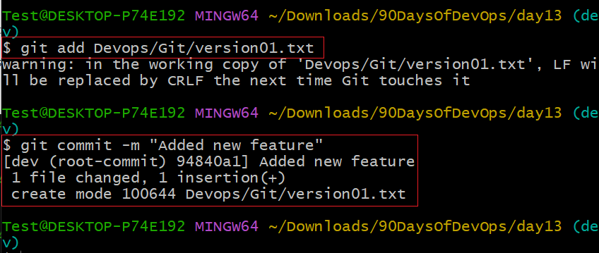
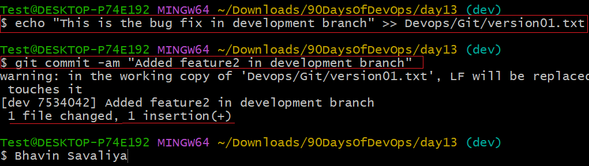
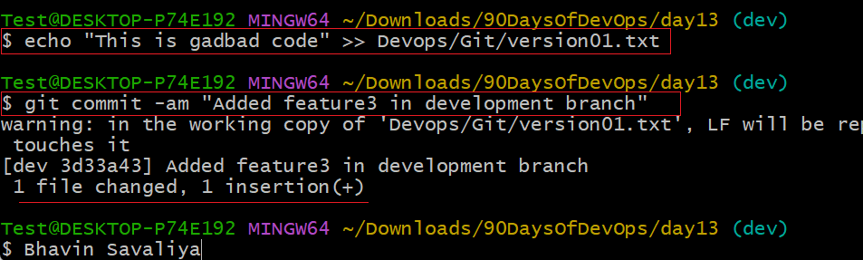
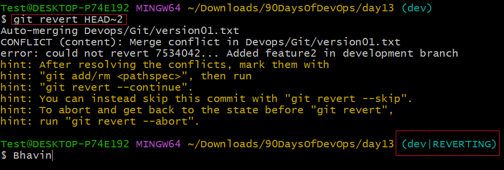
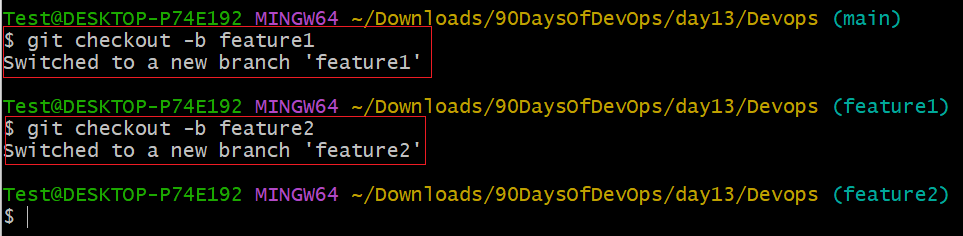
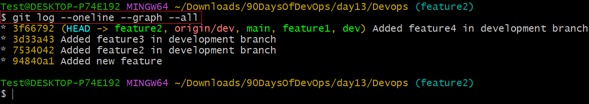
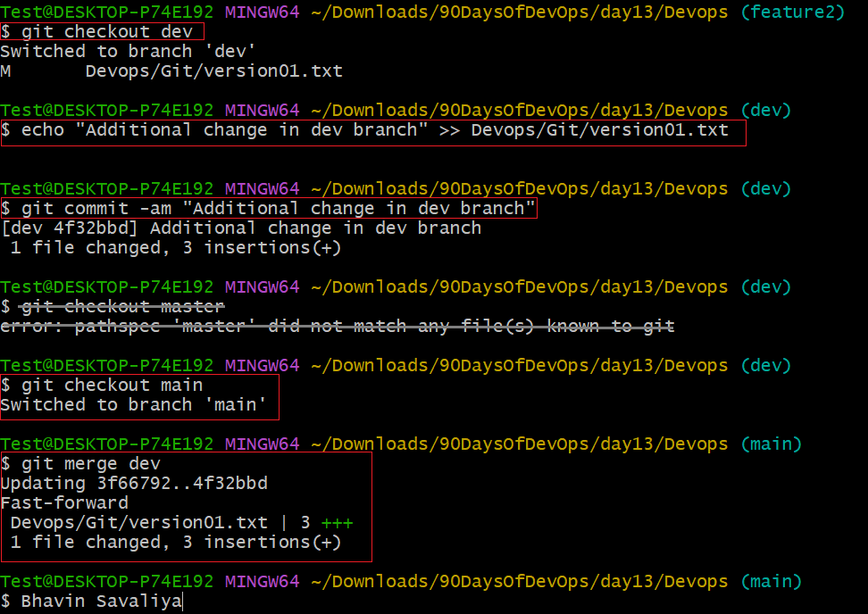
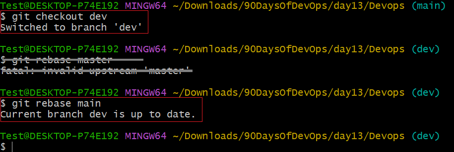

# Day 12 Answers: Advance Git & GitHub for DevOps Engineers

## Git Branching
Branches are a core concept in Git that allow you to isolate development work without affecting other parts of your repository. Each repository has one default branch, and can have multiple other branches. You can merge a branch into another branch using a pull request.

Branches let you develop features, fix bugs, or safely experiment with new ideas in a contained area of your repository.

## Git Revert and Reset
Git reset and git revert are two commonly used commands that allow you to remove or edit changes you’ve made in the code in previous commits. Both commands can be very useful in different scenarios.

# Git Rebase and Merge
## What Is Git Rebase?
Git rebase is a command that lets users integrate changes from one branch to another, and the commit history is modified once the action is complete. Git rebase helps keep a clean project history.

## What Is Git Merge?
Git merge is a command that allows developers to merge Git branches while keeping the logs of commits on branches intact. Even though merging and rebasing do similar things, they handle commit logs differently.

For a better understanding of Git Rebase and Merge, check out this article.

# Tasks with Answers

## Task 1: Feature Development with Branches

1. Create a Branch and Add a Feature:
 ■ Add a text file called version01.txt inside the Devops/Git/ directory with “This is the first feature of our application” written inside.

Answer

■ Create a new branch from master.
<pre>
git checkout -b dev
</pre>
Answer

■ Commit your changes with a message reflecting the added feature.
<pre>
git add Devops/Git/version01.txt
git commit -m "Added new feature"
</pre>

Answer

2. Push Changes to GitHub:
■ Push your local commits to the repository on GitHub.
<pre>
git push origin dev
</pre>

3. Add More Features with Separate Commits:
■ Update version01.txt with the following lines, committing after each change:

1️⃣ 1st line: This is the bug fix in development branch
<pre>
echo "This is the bug fix in development branch" >> Devops/Git/version01.txt
git commit -am "Added feature2 in development branch"
</pre>

Answer

2️⃣ 2nd line: This is gadbad code
<pre>
echo "This is gadbad code" >> Devops/Git/version01.txt
git commit -am "Added feature3 in development branch"
</pre>
Answer

3️⃣ 3rd line: This feature will gadbad everything from now
<pre>
echo "This feature will gadbad everything from now" >> Devops/Git/version01.txt
git commit -am "Added feature4 in development branch"
</pre>

4. Restore the File to a Previous Version:
■ Revert or reset the file to where the content should be “This is the bug fix in development branch”.
<pre>
git revert HEAD~2
</pre>
Answer

This command reverts the last two commits, effectively removing the "gadbad code" and "gadbad everything" lines.

## Task 2: Working with Branches
1. Demonstrate Branches:
■ Create 2 or more branches and take screenshots to show the branch structure.
Answer

2. Merge Changes into Master:
■ Make some changes to the dev branch and merge it into master.
<pre>
git checkout master
git merge dev
</pre>
Answer

■ Screenshot of branch structure:
1) To visualize the branch structure, you can use git log with graph options or a graphical tool like GitKraken.
Answer

3. Practice Rebase:
 1) Try rebasing and observe the differences.
<pre>
git rebase master
</pre>
Answer

■ During a rebase, Git re-applies commits from the current branch (in this case, dev) onto the target branch (master). This results in a linear commit history.
LinkedIn