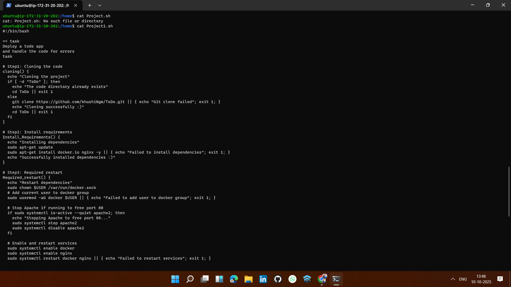
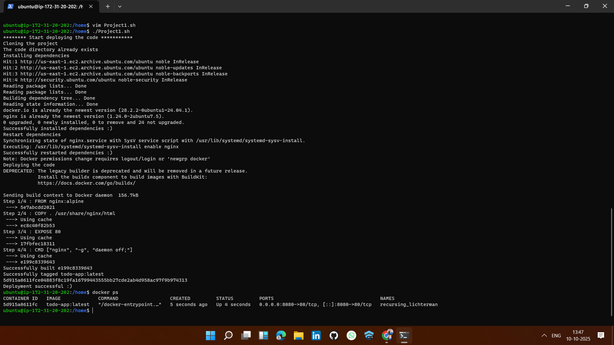
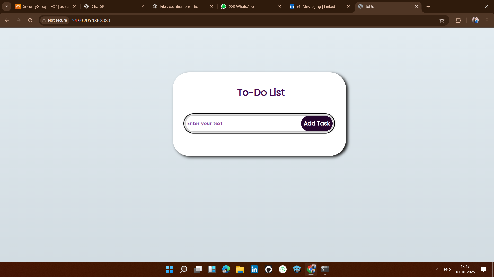

# ToDo App Deployment Script🚀
This project contains a Bash script `Project1.sh` to deploy a ToDo App using Docker and Nginx on an Ubuntu server.

## 📁 Project Structure
Project1.sh
ToDo/ (cloned repository)
Dockerfile
README.md

## Source Code
You can find the complete source code of this project here:
🔗 [ToDO App Repo](https://github.com/khushiNgm/ToDo)

<!--  -->

## 🛠 Requirements
| Tool | Version | Purpose |
|------|--------|---------|
|🐳 Docker | Latest | Containerization |
|🌐 Nginx | Latest | Web server |
| 💻 Ubuntu | 22.04+ | OS |
<!-- 
 -->

## ⚡ How to Use
1. Make the script executable:
   chmod +x Project1.sh
2. Run the script:
   ./Project1.sh
   
## Troubleshooting
- Docker permission denied: run `newgrp docker` or log out/in.
- Port 80 conflict: stop Apache using `sudo systemctl stop apache2`.## 

# ✅ Deployment Status 🎉

The ToDo App has been **successfully deployed** and is running on port `8080`.

